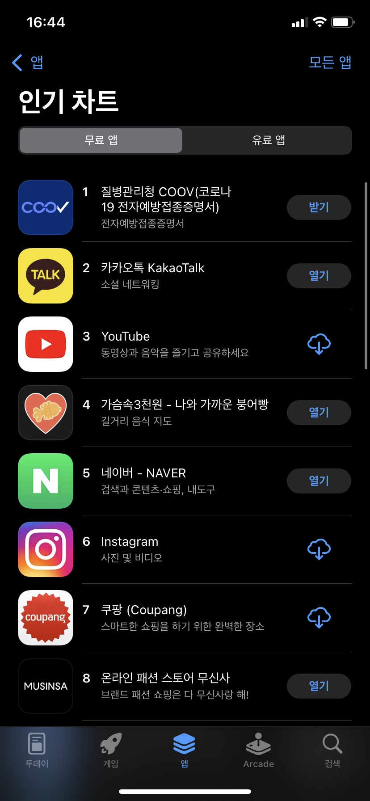
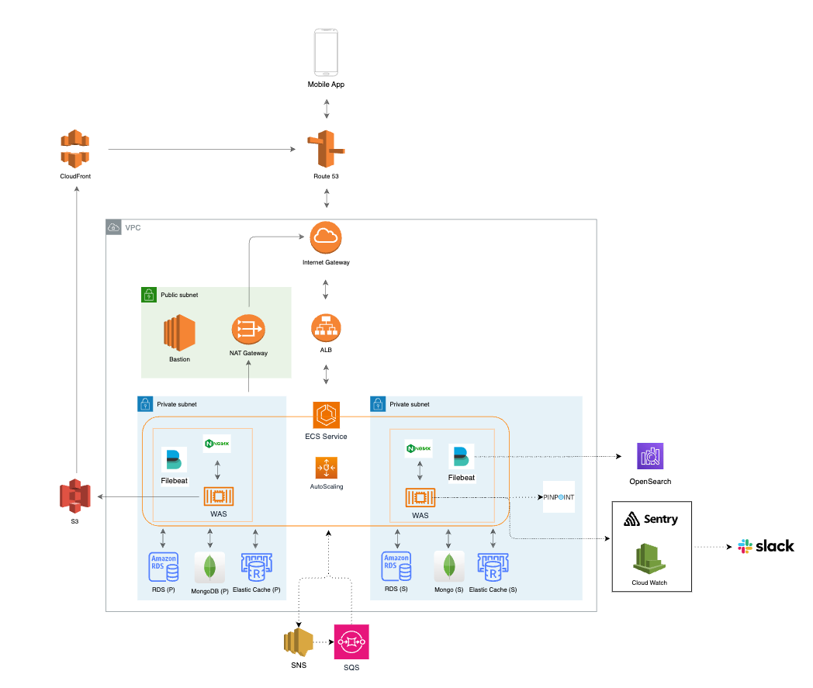

# 가슴속 삼천원 백엔드

> 유저 & 사장님 & 알림 서비스로, 레포는 현재 비공개로 운영중입니다.

## Introduction

전국 붕어빵 등 길거리 음식을 파는 곳을 알려주는 [**가슴속 3천원**](https://intro.threedollars.co.kr/)

**"가슴 속 3천원"** 은 겨울철 우리 가슴속에 지니고 다니는 3천원을 털어가는 붕어빵, 문어빵, 계란빵, 호떡 등을 파는 곳을 포함해 길거리 음식점들을 알려주는 사용자 기반 서비스입니다.

- 회원 수: 100만+, 월간 활성 유저 (MAU): 20만명의 사용자분들이 사용하고 계십니다.

## App Download

### 가슴속 3천원 (손님 앱)

- [AppStore](https://apps.apple.com/kr/app/%EA%B0%80%EC%8A%B4%EC%86%8D3%EC%B2%9C%EC%9B%90-%EB%82%98%EC%99%80-%EA%B0%80%EA%B9%8C%EC%9A%B4-%EB%B6%95%EC%96%B4%EB%B9%B5/id1496099467)
- [PlayStore](https://play.google.com/store/apps/details?id=com.zion830.threedollars)

### 가슴속 3천원 사장님 (사장님 앱)

- [AppStore](https://apps.apple.com/kr/app/%EA%B0%80%EC%8A%B4%EC%86%8D-3%EC%B2%9C%EC%9B%90-%EC%82%AC%EC%9E%A5%EB%8B%98/id1639708958)
- [PlayStore](https://play.google.com/store/apps/details?id=app.threedollars.manager)

    
    

## Service Diagram

## Architecture

## Skills

- Kotlin, Java 17
- Spring Framework (Spring Boot 3, Spring MVC, Spring Webflux, Spring Batch, Spring Data), Kotlin
  Coroutine
- MariaDB, MongoDB, Redis, JPA, QueryDSL, Flyway
- Junit5, Docker-compose
- Gradle
- Nginx, Filebeat
- ECS, ALB, S3, CloudFront, RDS, Elastic Cache, SNS, SQS
- Git, GitHub Actions, SonarQube
- CloudWatch, Sentry, Pinpoint, Jenkins (Scheduler), Elastic Stack, Slack

## Contacts

| 이름        | Email                       |
|-----------|-----------------------------|
| 가슴속 3천원   | 3dollarinmypocket@gmail.com |
| Developer | will.seungho@gmail.com      |
