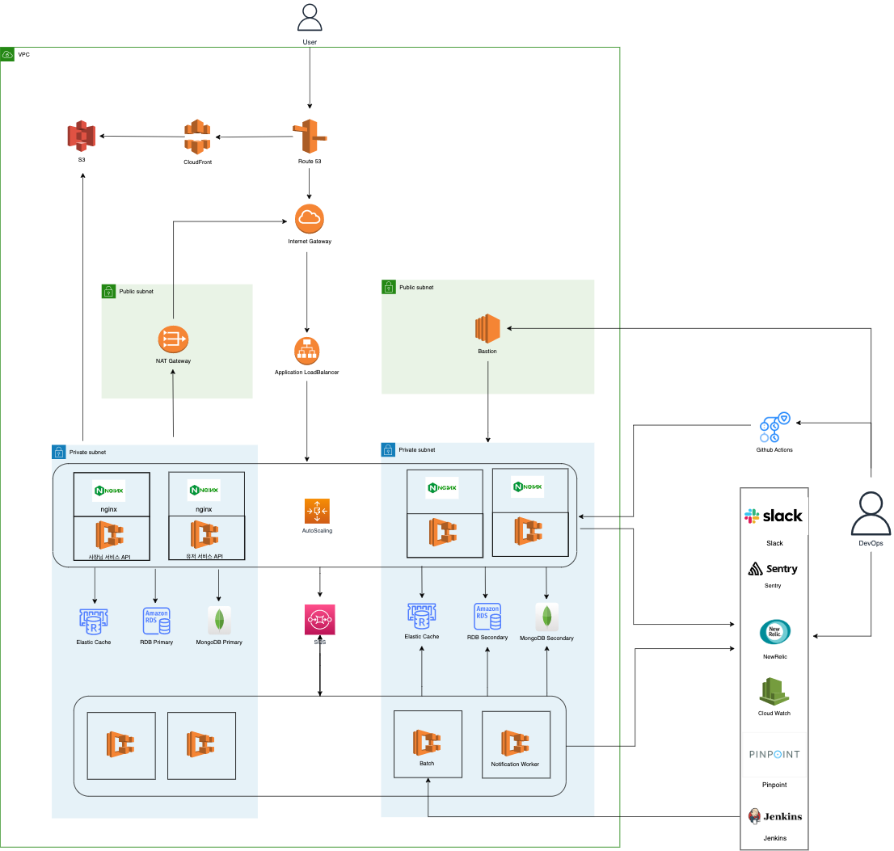

# 가슴속 삼천원 백엔드

### 프로젝트 설명

전국 붕어빵 등 길거리 음식을 파는 곳을 알려주는 [**가슴속 3천원**](https://intro.threedollars.co.kr/)

**"가슴 속 3천원"** 은 겨울철 우리 가슴속에 지니고 다니는 3천원을 털어가는 붕어빵, 문어빵, 계란빵, 호떡 등을 파는 곳을 포함해 길거리 음식점들을 알려주는 사용자 기반 서비스입니다.

- 회원 수: 80만+, 월간 활성 유저 (MAU): 20만명의 사용자분들이 사용하고 계십니다.

### 앱 다운로드

#### 가슴속 3천원 (손님 앱)

- [AppStore](https://apps.apple.com/kr/app/%EA%B0%80%EC%8A%B4%EC%86%8D3%EC%B2%9C%EC%9B%90-%EB%82%98%EC%99%80-%EA%B0%80%EA%B9%8C%EC%9A%B4-%EB%B6%95%EC%96%B4%EB%B9%B5/id1496099467)
- [PlayStore](https://play.google.com/store/apps/details?id=com.zion830.threedollars)

#### 가슴속 3천원 사장님 (사장님 앱)

- [AppStore](https://apps.apple.com/kr/app/%EA%B0%80%EC%8A%B4%EC%86%8D-3%EC%B2%9C%EC%9B%90-%EC%82%AC%EC%9E%A5%EB%8B%98/id1639708958)

    
    

## 기술 스택

- Kotlin 1.8, Java 17
- Spring Framework (Spring Boot, Spring MVC, Spring Batch, Spring Data)
- Kotlin Coroutine
- MariaDB, MongoDB, Redis, JPA, QueryDSL, Lettuce, Flyway
- Junit5
- Gradle
- ECS Fargate, ALB, Nginx, S3, CloudFront, SQS, RDS, Elastic Cache, EC2
- Git, GitHub Actions, SonarQube
- CloudWatch, Sentry, Pinpoint, NewRelic, Jenkins, Locust, Slack

## 개발자

| 이름  | Github                                    |
|-----|-------------------------------------------|
| 강승호 | [seungh0](https://github.com/seungh0)     |   
| 고예림 | [yerimkoko](https://github.com/yerimkoko) |

## Contacts

| 이름                | Email                       |
|-------------------|-----------------------------|
| 가슴속 3천원 공식 계정     | 3dollarinmypocket@gmail.com |
| Backend Developer | will.seungho@gmail.com      |
